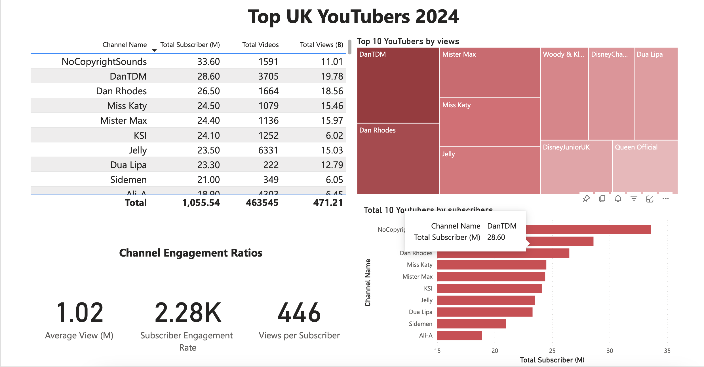

# Data portfolio

This is my learning portfolio!

🥸

To create a table of content: 
- in a square bracket: content name
- in a round bracket with a hashtag: to push to the section of the content
- subheader: add indentation
- embeded image: 
- code block: ''' language '''
- to create a table: dash and pipe

## Header 1

### Header 2

Table of content:

- [Objective](#objective)
- [Data source]
  - [Kaggle source](#Kaggle)
  - [Python](#Python)
- [Dashboard](#Dashboard)
- [Analysis in MyQSL](#analysis in MySQL)
- [Table](Table)

#Dashboard 

#Analysis in MySQL

'''sql

/*
# Data cleaning steps
1. Remove unnecessary columns by only selecting the ones we need
2. Extract the Youtube channel name from the first column
3. Rename the columns name
*/

CREATE VIEW view_uk_youtubers_2024 AS
    SELECT 
        CAST(SUBSTRING(NOMBRE,
                1,
                INSTR(NOMBRE, '@') - 1)
            AS CHAR (100)) AS channel_name,
        total_subscribers,
        total_views,
        total_videos
    FROM
        youtube_data_from_python_ascii;
        
/*
# Data quality tests
1. Data needs to have 100 records of Youtube channel (row count test) -- ok
2. The data needs 4 columns (column count test)
3. The channel name needs to be string format, the other columns must be numerical data type.
4. Each record must be unique in the dataset (duplicate count test)

*/
-- 1. Row count check
SELECT 
    COUNT(*) AS no_of_rows
FROM
    view_uk_youtubers_2024;

-- 2. Column count check
SELECT 
    count(*) as no_of_columns
FROM
    information_schema.columns
WHERE
    table_name = 'view_uk_youtubers_2024';
    
-- 3. Data type check
SELECT 
    column_name,
    data_type
FROM
    information_schema.columns
WHERE
    table_name = 'view_uk_youtubers_2024';
	
-- 4. Duplicate test
SELECT 
    channel_name, COUNT(*) AS duplicate_count
FROM
    view_uk_youtubers_2024
GROUP BY channel_name
HAVING duplicate_count > 1
;

/*

Data validation
1. Define the variables
2. Create a CTE that rounds the average views per videos
3. Select the columns that are required for the analysis
4. Filter the results by the Youtube channels with the highest subcriber base
5. Order by net_profit (from highest to lowest)

*/
-- 1. 

Set @conversion_rate  =0.02;
set @production_cost = 5;
set @campaign_cost = 50000;

-- 2.

SELECT 
    *
FROM
    (SELECT 
        channel_name,
            total_views,
            total_videos,
            ROUND(total_views / total_videos, -4) AS rounded_avg
    FROM
        view_uk_youtubers_2024) AS channel_data;

-- 3. 

Set @conversion_rate =0.02;
set @production_cost = 5;
set @campaign_cost = 50000;
SELECT 
    channel_name,
    rounded_avg,
    ROUND((rounded_avg * @conversion_rate), 0) AS potential_sales,
    ROUND((rounded_avg * @conversion_rate * @production_cost),
            0) AS potential_revenue,
    ROUND((rounded_avg * @conversion_rate * @production_cost - @campaign_cost),
            0) AS net_profit
FROM
    (SELECT 
        channel_name,
            total_views,
            total_videos,
            ROUND(CAST((total_views / total_videos) AS DECIMAL (10 , 2 )), - 4) AS rounded_avg
    FROM
        view_uk_youtubers_2024) AS channel_data
WHERE
    channel_name IN ('NoCopyrightSounds ' , 'DanTDM ', 'Dan Rhodes ')
ORDER BY net_profit DESC
;

'''

Table:

| Col 1 | Col 2 | Col 3|
| ----- | ----- | -----|
|Channel| DanMDT| 3.6 M|

